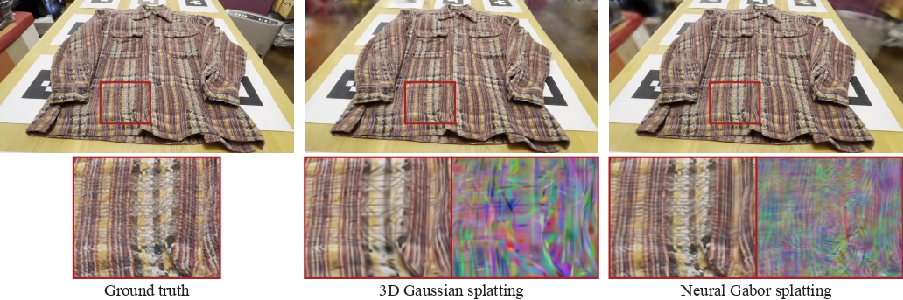

# VCNO-3DGS: Vehicle-Context Neural Optimization for 3D Gaussian Splatting



VCNO-3DGS is a vehicle-oriented extension of 2D Gaussian Splatting. It uses a
reliability-filtered vehicle-detail signal to coordinate three training modules:

- **Vehicle appearance**: reliability-aware neural appearance and detail supervision.
- **Vehicle allocation**: reliability- and visibility-guided Gaussian clone, split, and pruning.
- **Vehicle geometry**: confidence-gated TSDF surface fusion and Gaussian pull.

The code is based on 2D Gaussian Splatting and keeps the original COLMAP-style
data loader, renderer, and metric workflow.

## Repository Layout

```text
arguments/                 Command-line arguments and VCNO module presets
gaussian_renderer/          Differentiable rendering interface
scene/                      Gaussian models and scene loading
utils/                      Losses, reliability maps, TSDF fusion, and helpers
scripts/                    Metric aggregation and figure/diagnostic utilities
submodules/                 CUDA rasterization and simple-knn dependencies
error-inverse-projector/    CUDA inverse-projection operator for budgeting
train.py                    Training entry point
render.py                   Render train/test views or a camera path
metrics.py                  PSNR/SSIM/LPIPS evaluation
```

Datasets, trained models, paper build files, and local experiment outputs are not
part of the GitHub code release.

See `NOTICE.md` for the distinction between VCNO-3DGS additions and retained
upstream components.

## Installation

Clone the repository and create the conda environment:

```bash
git clone <repository-url> VCNO-3DGS
cd VCNO-3DGS
conda env create -f environment.yml
conda activate vcno_3dgs
```

The environment installs the local CUDA extensions listed in `environment.yml`:

```text
submodules/diff-surfel-rasterization
submodules/diff-neural-gabor-rasterization
submodules/simple-knn
error-inverse-projector
```

You need a CUDA-capable PyTorch setup and a working CUDA compiler compatible with
your PyTorch version.

## Data Format

VCNO-3DGS uses the same COLMAP scene structure as 3DGS/2DGS:

```text
scene_root/
|-- images/
`-- sparse/0/
    |-- cameras.bin
    |-- images.bin
    `-- points3D.bin
```

For held-out evaluation, use `--eval`. The loader will use the train/test split
defined by the 3DGS-style dataset reader.

## Training

### Baseline 2DGS

Run without VCNO module flags to train the 2DGS baseline:

```bash
python train.py \
  -s <path-to-colmap-scene> \
  -m output/<scene>/2dgs \
  --eval \
  --iterations 20000 \
  --init_point_num 5000 \
  --max_primitive_num 20000 \
  --test_iterations 20000 \
  --save_iterations 20000
```

### Full VCNO-3DGS

Use `--vehicle_full` to enable all three paper modules:

```bash
python train.py \
  -s <path-to-colmap-scene> \
  -m output/<scene>/vcno \
  --eval \
  --vehicle_full \
  --iterations 20000 \
  --init_point_num 5000 \
  --max_primitive_num 20000 \
  --test_iterations 20000 \
  --save_iterations 20000
```

`--vehicle_full` expands to:

```text
--vehicle_appearance
--vehicle_allocation
--vehicle_geometry
```

The module flags can also be used independently for ablations:

```bash
python train.py -s <scene> -m output/<scene>/appearance --eval --vehicle_appearance
python train.py -s <scene> -m output/<scene>/allocation --eval --vehicle_appearance --vehicle_allocation
python train.py -s <scene> -m output/<scene>/full --eval --vehicle_full
```

Backward-compatible aliases are also available:
`--ours_appearance`, `--ours_frequency`, `--ours_geometry`, and `--ours_full`.

## Paper-style Vehicle Settings

The paper experiments use scene-specific primitive caps and initial point counts.
The following commands show the settings used for the main vehicle scenes.

| Scene | Iterations | Init points | Primitive cap | Example extra setting |
|---|---:|---:|---:|---|
| Truck | 20000 | 5000 | 20000 | `--car_fusion_tsdf_pull_weight 0.00025` |
| Train | 20000 | 10000 | 30000 | standard VCNO geometry preset |
| Red Sedan | 20000 | 10000 | 40000 | `--resolution 2` |
| Van | 20000 | 15000 | 50000 | `--resolution 2` |
| Gray SUV | 20000 | 5000 | 50000 | standard VCNO geometry preset |
| Blue EV | 20000 | 5000 | 60000 | standard VCNO geometry preset |

Example:

```bash
python train.py \
  -s <path-to-truck> \
  -m output/truck/vcno \
  --eval \
  --vehicle_full \
  --iterations 20000 \
  --init_point_num 5000 \
  --max_primitive_num 20000 \
  --car_fusion_tsdf_pull_weight 0.00025 \
  --test_iterations 20000 \
  --save_iterations 20000
```

For larger object-centric vehicle scenes:

```bash
python train.py \
  -s <path-to-van> \
  -m output/van/vcno \
  --eval \
  --vehicle_full \
  --resolution 2 \
  --iterations 20000 \
  --init_point_num 15000 \
  --max_primitive_num 50000 \
  --test_iterations 20000 \
  --save_iterations 20000
```

## Important VCNO Options

Most users should start with `--vehicle_full`. The lower-level options are kept
for reproduction and ablation:

| Option | Purpose |
|---|---|
| `--vehicle_appearance` | Enables reliability-aware neural appearance and detail losses. |
| `--vehicle_allocation` | Enables reliability/visibility-guided primitive budgeting. |
| `--vehicle_geometry` | Enables scheduled TSDF fusion and confidence-gated geometry pull. |
| `--car_fusion_detail_photometric_weight` | Detail photometric loss weight, default `0.015`. |
| `--car_fusion_densify_reliability_floor_start` / `--car_fusion_densify_reliability_floor_end` | Reliability floor schedule for budgeting. |
| `--car_fusion_tsdf_iters` | TSDF fusion schedule. The geometry preset uses `500,1500,2500,4000,7000,10000,15000`. |
| `--car_fusion_tsdf_voxel_size` | TSDF voxel size, default `0.02`. |
| `--car_fusion_tsdf_pull_interval` | TSDF pull interval, default `100`. |
| `--car_fusion_tsdf_pull_weight` | TSDF pull strength, default at least `0.00015` under `--vehicle_geometry`. |

## Rendering

Render both training and held-out views:

```bash
python render.py \
  -s <path-to-colmap-scene> \
  -m output/<scene>/vcno \
  --skip_mesh
```

Render only held-out views:

```bash
python render.py -s <scene> -m output/<scene>/vcno --skip_train --skip_mesh
```

Render a camera trajectory:

```bash
python render.py -s <scene> -m output/<scene>/vcno --render_path --skip_mesh
```

By default, `render.py` writes rendered images under:

```text
<model_path>/train/ours_<iteration>/
<model_path>/test/ours_<iteration>/
```

## Metrics

After rendering, compute PSNR, SSIM, and LPIPS on the held-out test split:

```bash
python metrics.py -m output/<scene>/vcno
```

Multiple models can be evaluated at once:

```bash
python metrics.py -m output/truck/vcno output/train/vcno output/van/vcno
```

The script writes:

```text
<model_path>/results.json
<model_path>/per_view.json
```

For paper-style all-view aggregation, first evaluate train and test renders
separately with the streaming evaluator:

```bash
python metrics_stream.py -m output/<scene>/vcno --split train
python metrics_stream.py -m output/<scene>/vcno --split test
```

This writes:

```text
<model_path>/results_train.json
<model_path>/per_view_train.json
<model_path>/results_test.json
<model_path>/per_view_test.json
```

Then aggregate train and test views:

```bash
python scripts/aggregate_all_metrics.py output/<scene>
```

## Notes for Reproducing the Paper

- Main-table metrics are computed from rendered train and held-out views.
- The reported VCNO rows use `--vehicle_full` with scene-specific primitive caps.
- Red Sedan and Van use `--resolution 2`.
- The Truck setting uses a stronger TSDF pull weight (`0.00025`) in the selected
  grid setting.
- DHO-3DGS and EFA-GS are external baselines and are not included in this code
  release.
- Local datasets and trained outputs should stay outside the repository, for
  example under `D:/VCNO-3DGS/all-data` and `D:/VCNO-3DGS/all_task_data`.

## Acknowledgements

This project builds on:

- 3D Gaussian Splatting: https://github.com/graphdeco-inria/gaussian-splatting
- 2D Gaussian Splatting: https://github.com/hbb1/2d-gaussian-splatting

Base 2DGS commit:

```text
1920a2395f13a285da80982acdb13a8b9e12f1cf
```

## License

This repository is released for non-commercial research and evaluation under the
upstream Gaussian Splatting license in `LICENSE.md`. Retained upstream copyright
notices are preserved in source files for license compliance. See `NOTICE.md`.

## Citation

Citation metadata will be added after manuscript release.
